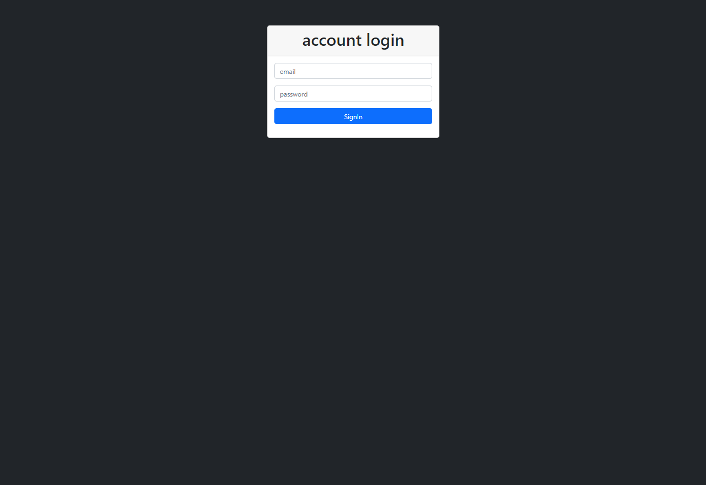
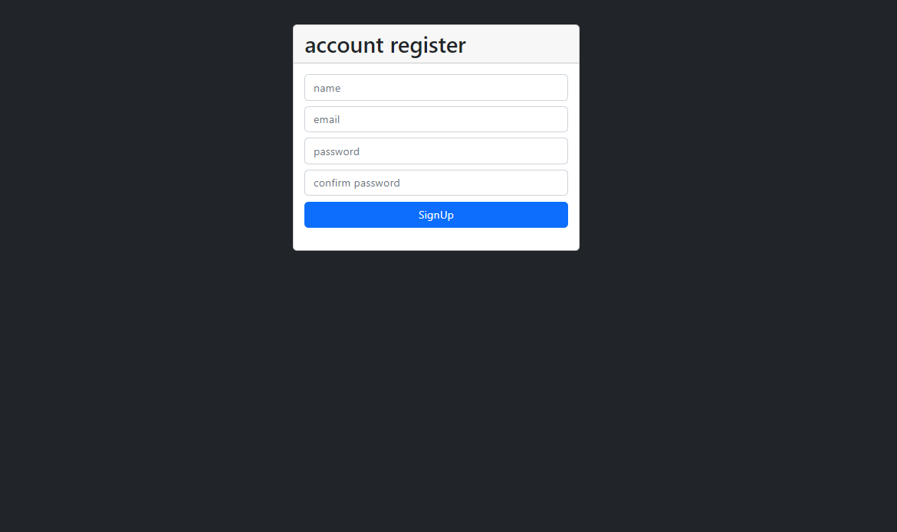
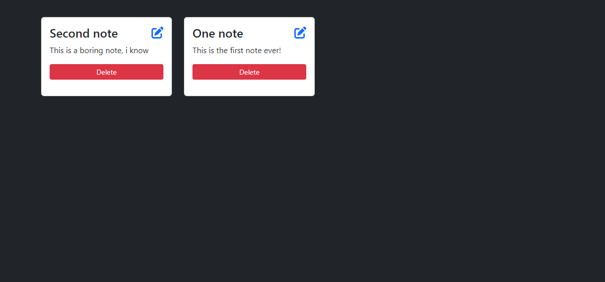
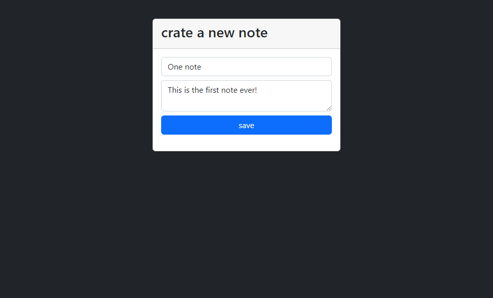
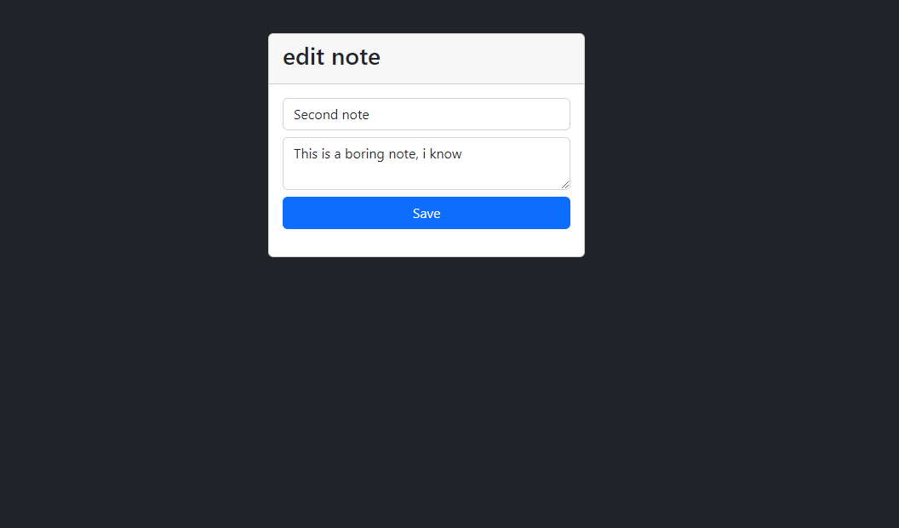
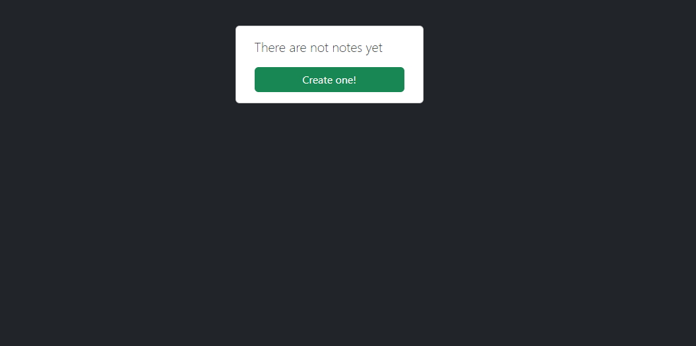

# notes app nodejs mongodb
simple application for managing notes with nodejs

## ACCOUNT LOGIN

## ACCOUNT SIGNUP

## GETING ALL NOTES

## CREATING ONE NOTE

## EDIT ONE NOTE

## NO NOTES CREATED YET, EMPTY NOTES

